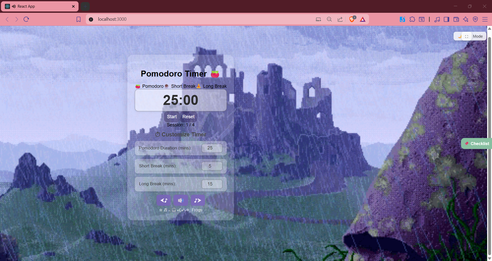

🌿 CalmQuest — Your Mindful Productivity Companion

    

CalmQuest is a soft, minimalistic, and soothing productivity app designed to help you focus, relax, and reclaim your day. Built with intention, it brings together serene visuals, ambient sounds, and Pomodoro-style task flow to guide you toward clarity and calm.

✨ Features
🎧 Ambient Audio – Calming soundtracks to reduce stress & anxiety

🧘‍♀️ Minimal Interface – Designed to avoid distractions

⏳ Pomodoro Flow – Stay focused with intentional work/rest cycles

🌗 Dark Mode Friendly – Soft tones and gentle transitions

💾 Progress Saving (Optional) – Track sessions with local state

🛠️ Tech Stack
Frontend: React (Expo-compatible structure)

Styling: CSS / Styled Components (based on your setup),JSX,Javascript

Assets: Soothing backgrounds, icons, and audio files

📸 Preview

    <i>“A gentle nudge into your calm zone.”</i> 

(Add actual screenshots or a GIF demo if you can!)

🚀 Getting Started
bash
Copy
Edit
git clone https://github.com/sansita2412/calmquest.git
cd calmquest
npm install
npm start
Make sure Node.js is installed. CalmQuest runs in any browser. You can also convert it to an Expo mobile app (ask me if you want help with that).

🧠 Inspiration
This project was born from a personal desire to create a peaceful digital space — a zone that helps users like me manage productivity without burnout.

📌 To-Do / Roadmap
 Core Pomodoro Timer

 Audio background loops

 Add user stats and streaks

 Expand ambient audio library

 Optional authentication + data sync

🤍 Author
Sansita Sharma
GitHub • LinkedIn • Portfolio (add links if you want)

📄 License
This project is licensed under the MIT License.

⭐ If you like it…
Please consider starring the repo — it means the world!
